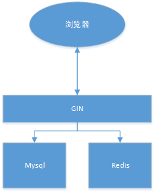

# Container

#### 介绍
从零开始搭建Go的GIN项目并部署到Docker, 使用K8s容器编排与Jenkins完成持续化集成

#### 软件架构

#### 技术选型
| 名称  | 地址                                          | 备注             |
| ----- | --------------------------------------------- | ---------------- |
| GIN   | https://github.com/gin-gonic/gin              | Web框架          |
| Gorm  | https://github.com/jinzhu/gorm                | ORM框架          |
| Swag  | https://github.com/swaggo/swag/blob/master/README_zh-CN.md | 接口文档         |
| Redis | https://github.com/go-redis/redis             | 缓存             |
| Mysql | https://github.com/jinzhu/gorm/dialects/mysql | 关系型数据库驱动   |

